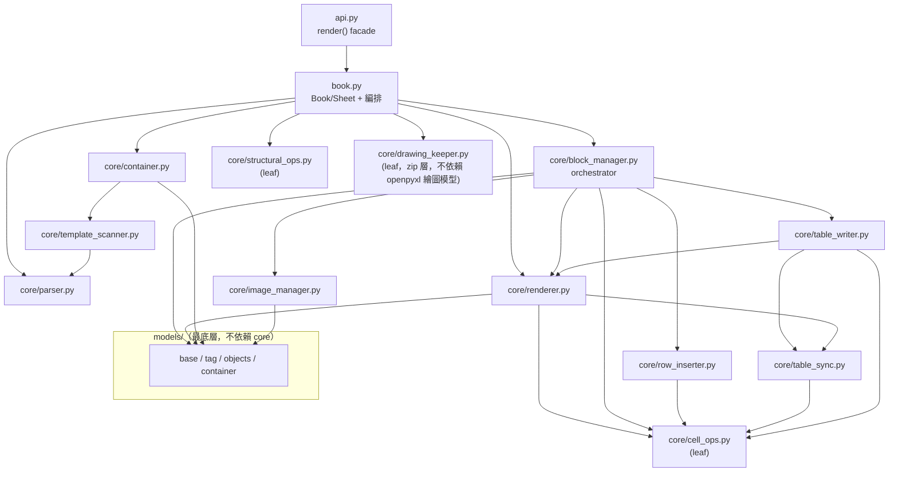
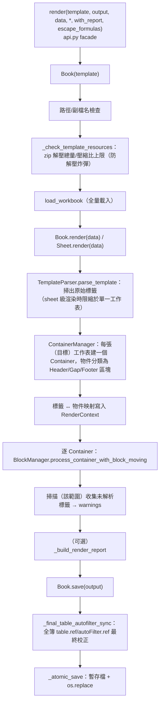
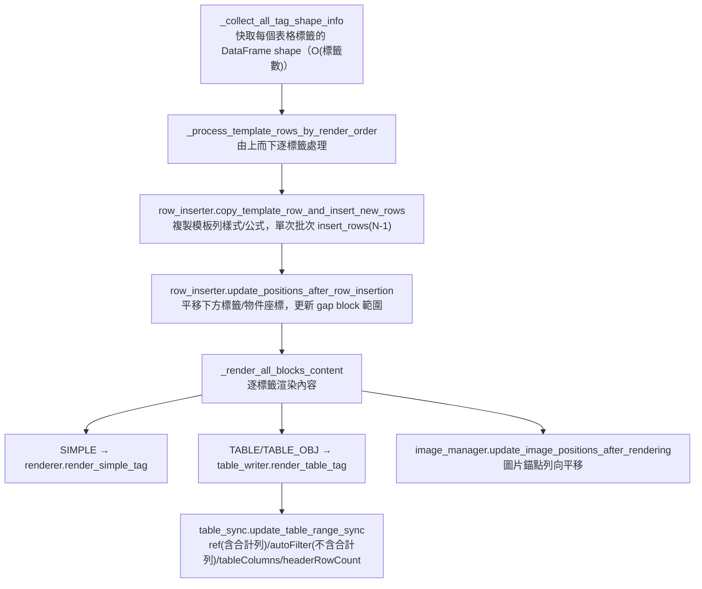

# templexl 程式架構說明（開發者 / Code Review 指南）

> 受眾：套件貢獻者與 code reviewer。
> 對應版本：0.1.0。
> 使用者文件請見 [USER_GUIDE.md](USER_GUIDE.md)。

## 1. 套件是什麼

`templexl` 是基於 openpyxl 的 Excel 模板報表引擎：載入一份含
`{{變數}}` / `#{{資料表}}` 標籤的 .xlsx 模板，將純量與 pandas DataFrame
填入後輸出報表，全程**保留模板的樣式、合併儲存格、Excel Table 物件、
公式與圖片**。定位為 excel template 模板渲染的工具，無需安裝 Excel。

「模板樣式保留」是核心賣點，也是最重要的架構約束：它排除了
openpyxl `read_only`/`write_only` 串流模式與 xlsxwriter 等只寫引擎，
決定了全套件採**全量記憶體模型**（見 §6）。

## 2. 模組地圖

```
src/templexl/
├── __init__.py        公開匯出（render、Book、Sheet、結果型別、例外階層）
├── api.py             render() facade——建於 Book 之上的一次性糖衣
├── book.py            ★ Book/Sheet 會話物件 + 渲染編排、zip 資源檢查、
│                        原子寫入、warnings 收集、報告組裝
├── context.py         RenderContext：一次渲染的資料與標籤映射
├── result.py          RenderResult / BookRenderResult / SheetRenderResult
├── report.py          RenderReport dataclass（可選渲染報告）
├── exceptions.py      例外階層（基底 TemplateError）
├── core/
│   ├── template_scanner.py  掃描工作表中的標籤/表格/圖片物件
│   ├── parser.py            標籤語法解析（{{}}、#{{}}、| 條件）
│   ├── container.py         ContainerManager：物件收集與區塊分類
│   ├── block_manager.py     ★ 渲染主流程 orchestrator
│   ├── renderer.py          ★ 標籤 → 儲存格的核心渲染
│   ├── cell_ops.py          葉模組：樣式複製/公式平移/資料寫入單一入口
│   ├── structural_ops.py    葉模組：Excel 等效刪整欄（合併/欄寬/列印範圍）
│   ├── row_inserter.py      模板列複製與批次插入（row shifting）
│   ├── table_writer.py      DataFrame → Excel Table 寫入（bm 側）
│   ├── table_sync.py        Table 幾何同步（範圍、篩選範圍、合計列保留）與動態起始列
│   ├── image_manager.py     圖片錨點掃描與列向平移
│   └── drawing_keeper.py    模板繪圖保留：形狀／openpyxl 會丟棄的圖片／
│                              頁首頁尾 VML 的 zip 層擷取與回填（不依賴
│                              openpyxl 繪圖模型）
└── models/
    ├── base.py              枚舉與座標原語（ObjectType、CellPosition…）
    ├── tag.py               Tag
    ├── objects.py           ObjectInfo、Block、ImageObject
    └── container.py         Container（一張工作表的物件/區塊集合）
```

### 依賴方向（單向、無循環）



Review 時的鐵律：

- **`cell_ops.py`、`structural_ops.py`、`drawing_keeper.py` 是葉模組**——
  不得 import 任何其他 core 模組（防循環）。`drawing_keeper.py` 更進一步：
  只操作 zip／lxml 層，刻意不依賴 openpyxl 的繪圖物件模型（openpyxl 無法
  表示這些內容，模型本身沒有對應位置）。
- **`models/` 不得 import `core/`**。
- `table_sync.py` 獨立於 `table_writer.py` 存在的原因就是打破
  renderer ↔ table_writer 的潛在循環。
- **`api.py` 只依賴 `book.py`，反向不成立**——渲染編排只有 `book.py` 一份，
  `render()` 不得長回自己的 load/save 流程。

## 3. 渲染管線（book.py 編排）



**範圍限定**：`sheet_names` 參數自 `book._execute_render_pipeline` 下推至
`TemplateParser.parse_template`、`TemplateScanner.scan_and_register_template`
與 `ContainerManager.create_containers`（皆預設 `None` = 全簿）。掃描、映射、
渲染三階段一併限縮，使 `Sheet.render()` 完全不讀寫其他工作表——這是
「複製同一份模板工作表 N 份、每份不同資料」的基礎。

### BlockManager 內部（單一 Container 的處理）



關鍵順序約束：**先插列、再渲染**。列空間必須在寫資料前一次擴增完成，
否則下方物件座標會失準；這也是效能線性化的來源（見 §6）。

## 4. 各模組職責與 review 重點

| 模組 | 職責 | Review 重點 |
|---|---|---|
| `api.py` | `render()` facade：開 Book → 全簿渲染 → 存檔 | 不得長回自己的 load/save 編排；例外皆須收斂為 `TemplateError` 階層 |
| `book.py` | Book/Sheet 會話物件、入口驗證、管線編排、安全檢查、原子寫入、warnings/report | 生命週期唯一歸屬 Book；`__exit__` 不得自動存檔；`output` 只在 `_atomic_save` 寫入；不得新增 openpyxl 原生已能正確完成的操作包裝 |
| `structural_ops.py` | Excel 等效刪整欄：合併範圍縮併/丟棄、欄寬左移、列印範圍收縮、危險特徵 fail fast | 無法保證正確的特徵一律拒絕（尤其公式：複製語意 ≠ 刪除語意），不得改為「盡力而為」 |
| `block_manager.py` | orchestrator：shape 快取、render order 主迴圈、簡單標籤 fallback | 不該再長出渲染細節——新邏輯應下沉到對應模組 |
| `renderer.py` | 標籤 → 儲存格：純量替換、DataFrame 展開、模板列樣式套用、合併儲存格偏移 | 熱迴圈（`_render_dataframe_data`）不得加入逐格日誌或 O(n) 呼叫 |
| `cell_ops.py` | `write_data_value()`（資料寫入單一入口 + 公式中和）、樣式複製（fast 為主）、`translate_formula()`（openpyxl Translator，Excel 複製語意） | **所有執行期資料寫入必須經 `write_data_value`**，繞過即是公式注入面；公式平移一律經 `translate_formula`；分支順序為熱路徑優先，調整時須確保所有缺失值仍收斂為空白儲存格 |
| `row_inserter.py` | 批次列插入與座標平移 | `insert_rows` 必須單次批次呼叫，禁止逐列插入（O(n²) 回歸）；**熱迴圈**（模板列複製）不得加入逐格/逐列日誌或 O(n) 呼叫——per-row f-string 即使 DEBUG 關閉仍為 eager 求值 |
| `table_writer.py` | DataFrame → Table 物件寫入、範圍更新（bm 側） | `escape_formulas`/`shape_info_cache` 為顯式參數，不得改回隱式全域；樣式一律由模板列複製決定，不得自行添加框線等樣式；**熱迴圈**（資料寫入）不得加入逐格日誌或 O(n) 呼叫，缺失值正規化集中於 `_iter_normalized_rows` 單點 |
| `table_sync.py` | 表格幾何同步（`ref`＝表頭＋body＋合計列、`autoFilter`＝表頭＋body、合計列旗標與公式保留）、表格樣式保留、動態起始列（gap 計算） | `original_table_positions` 快取由 renderer 實例持有並顯式傳入；篩選範圍規則只寫在 `expected_autofilter_ref()`，渲染後同步／屬性驗證／存檔前最終同步三處共用，不得各自硬設 |
| `image_manager.py` | 圖片錨點掃描/列向平移 | 只處理列向；欄向位移是已知未支援 |
| `drawing_keeper.py` | 模板繪圖保留（葉模組）：擷取判定鏡像 openpyxl `find_images()`；zip 層回填形狀／EMF／頁首頁尾 VML；媒體與部件一律取空號；擷取與回填失敗一律上拋（fail fast，不吞例外） | 擷取判定須與 openpyxl 版本行為保持一致（見模組內對照 `_blip_rels`/`_chart_rels` 的註解）；回填媒體一律經 `_place_media()` 取空號，不得沿用模板原始檔名；`capture_unsupported_drawings`／`restore_drawings` 內**不得**新增 `try/except` 吞例外 |
| `models/*` | 純資料結構與枚舉 | 保持無行為、無上層依賴 |

### 有狀態的物件（僅四處）

全套件刻意將可變狀態壓到最少，review 新增狀態時請先質疑必要性：

1. `BlockManager.shape_info_cache` —— 標籤 shape 快取（O(標籤數)），
   渲染中供 table_writer 取 gap 資訊。
2. `TemplateRenderer._original_table_positions` —— 同工作表多表格的
   原始位置快取，供 table_sync 動態起始列計算，**顯式傳參**進模組函式。
3. `RenderContext` —— 一次渲染的資料 dict 與 tag 映射；DataFrame 以
   參照傳遞，全程不複製。
4. `Book` —— **僅生命週期狀態**（workbook 參照、來源模板路徑、關閉旗標）。
   渲染中段仍為無狀態穿越：`RenderContext` 每次 `render()` 呼叫新建即棄。
   「會話」本身即為使用者要的能力（在 load 與 save 之間插入操作），
   狀態即需求，無法以無狀態函式表達——這正是 `render()` 表達不了
   「渲染後結構後處理」與「逐 sheet 填不同資料」的原因。
   註：`Sheet` 為每次自 `Book.sheets` 取用時建立的輕量包裝，**不持有狀態**；
   重複渲染的偵測改以「該工作表是否仍存在標籤」結構性判斷，不需渲染旗標。

## 5. 安全設計

| 面向 | 機制 | 位置 |
|---|---|---|
| 公式注入 | `write_data_value()` 對 data 來的字串，首字元屬 `= + - @ \t \r` 時強制 `cell.data_type = 's'`（值零改寫）；`escape_formulas=False` 可顯式停用。模板作者的公式不經此函式，照常保留 | `cell_ops.py` |
| 模板/資料的邊界 | 簡單標籤替換以「原儲存格值是否以 `=` 開頭」判定：模板公式含標籤 → 保留公式語意；純文字標籤 → 替換結果視為資料值中和 | `renderer._render_simple_data`、`block_manager._render_simple_tag` |
| 解壓炸彈 | 載入前以 `zipfile` 檢查解壓總量（2GB）與壓縮比（200:1），超限拋 `TemplateResourceError`；無效 zip 拋 `FileFormatError` | `book._check_template_resources` |
| 半成品輸出 | 同目錄暫存檔 + `os.replace` 原子取代；失敗清理暫存檔。**`render()` 與 `Book.save()` 共用同一實作**，無第二條落地路徑 | `book._atomic_save` |
| 靜默損壞的結構編輯 | 刪欄前掃描公式/圖片/圖表/Table/條件格式/資料驗證，任一存在即拋 `StructuralEditError`（訊息含種類與位置），不做任何修改 | `structural_ops._reject_unsupported_features` |
| 日誌洩漏 | 日誌（含 DEBUG）只記流程/位置/形狀，**不得輸出儲存格資料值**；套件掛 `NullHandler` | 全模組慣例，由 `tests/test_observability.py` 釘住 |

## 6. 效能與記憶體模型

- **時間線性**：實測 10k=1.5s／100k=15.5s／500k=78.7s（Apple Silicon、
  單表 5 欄）。線性的前提有二，review 時務必守住：
  1. 渲染迴圈內**不得**呼叫 `worksheet.max_column`/`max_row`
     （每次全表掃描 → O(n²)，第一階段重構的主要教訓）；
  2. 列擴增用單次批次 `insert_rows`，禁止逐列插入。
- **記憶體線性、無分批**：openpyxl 全載模式下每個帶值儲存格是常駐
  Python 物件。實測 500k×5 欄峰值 RSS ~2.8GB（tracemalloc 顯示其中
  ~2.2GB 為 Python 物件，餘為序列化緩衝）。這是「樣式保留」的結構性
  代價，**不要**嘗試導入 write_only/串流（會摧毀核心賣點）；更大量級
  的正解是分批多檔輸出（未實作，見 openspec 規劃）。
- 基準工具：`uv run python -m tests.benchmark <rows> [trace]`。
  `trace` 開啟 tracemalloc（時間放大 2-4 倍，勿與歷史時間基線比較）。

## 7. 測試策略

```
tests/
├── test_golden.py            ★ 黃金檔案測試：兩個真實模板逐格比對
│                               （值/樣式/合併/表格範圍/公式/圖片錨點）
├── golden_compare.py         逐格比對引擎
├── generate_golden.py        重生基準檔（僅在刻意的行為變更時使用）
├── test_characterization.py  具名行為案例：LOCK-CORRECT（不得破壞）
│                               與 LOCK-DEFECT（已知缺陷釘住，修復時須更新）
├── test_public_api.py        公開 API 契約（簽章/例外/匯出範圍）
├── test_input_safety.py      公式中和/zip 防護/原子寫入
├── test_observability.py     DEBUG 不拋例外、日誌不含資料值
├── test_book.py              Book 會話契約 + ★ parity：Book 全簿渲染 ≡ render()
├── test_sheet_render.py      sheet 級渲染：範圍限定/warnings 範圍/no-op
│                               + ★ parity：逐 sheet 渲染 ≡ 全簿渲染
├── test_column_delete.py     Excel 等效刪欄：合併四型/欄寬稀疏/列印範圍/fail fast
├── test_drawing_preservation.py  模板繪圖保留：形狀/EMF/頁首頁尾圖片/
│                               媒體不衝突/套件完整性/fail fast/物件鍵綁定
├── test_multisheet_baseline.py  多工作表基線（工作表順序、各表資料不外溢）
└── benchmark.py              效能/記憶體基準（非 pytest）
```

兩條 **parity 測試**是雙入口架構的安全網：`render()` 與 `Book` 共用同一份
編排、`Sheet.render()` 逐一渲染與 `Book.render()` 全簿渲染輸出等價，皆以
黃金比對引擎逐格驗證。任一入口的行為漂移都會即刻亮紅燈。

**黃金測試是一切重構的仲裁者**：行為保留型的 PR 必須 golden 全綠且
基準檔零變動；刻意的行為變更必須重生基準檔並在 commit 訊息中說明。

## 8. 已知技術債

目前無已知重大技術債。刻意保留的設計備註：

- `safe_copy_cell_style` 目前零呼叫者，**刻意保留**作為跨 workbook
  複製的後備——fast 版複製的 `_style` 索引是 workbook 範圍的
  StyleArray 參照，跨簿不可轉移。同 workbook 一律用 fast 版。
- 圖片僅支援列向錨點平移（欄向未支援），屬已知功能限制而非債，
  記錄於 README 已知限制。
- **刪欄的公式支援（v2 預留路線）**：`delete_columns()` 目前對任何含公式的
  工作表 fail fast。要支援需實作**刪除語意的參照改寫器**——與 `cell_ops`
  現有的 `translate_formula`（Excel **複製語意**）不同：刪欄時公式自身不移動，
  但指向刪除欄右側的參照（**含 `$` 絕對參照**）須左移一欄、指向被刪欄者須變
  `#REF!`、左側參照不動。可建於同一 openpyxl tokenizer 地基，但**不得**以
  Translator 代打（兩者僅在窄情境碰巧等價，硬套會靜默算錯）。
  觸發時機：下游 TPS01 表四遷移（依 city2~4 是否為空刪最多 6 欄）確認
  需要含公式的模板時。
- **sheet 級渲染的重複掃描**：`Sheet.render()` 每次呼叫都會重新掃描該工作表
  （範圍已限縮，不掃其他表）。N 張工作表逐一渲染即 N 次掃描，對「複製 N 份
  小工作表」的實務規模可忽略；若未來出現「數十張大工作表逐一渲染」的用例，
  可考慮跨呼叫快取 Container。

## 9. 開發流程

```bash
uv sync                                # 安裝相依（含 dev）
uv run pytest                          # 全套測試（目前 156 項；Pillow 為正式依賴，非可選）
uv run python -m tests.benchmark 100000    # 效能基準
uv build                               # 建置發行套件
```

規格與變更管理採 OpenSpec（`openspec/specs/` 為現行能力規格；
`openspec/changes/` 為進行中/歸檔的變更提案），不納入 git 版控。
