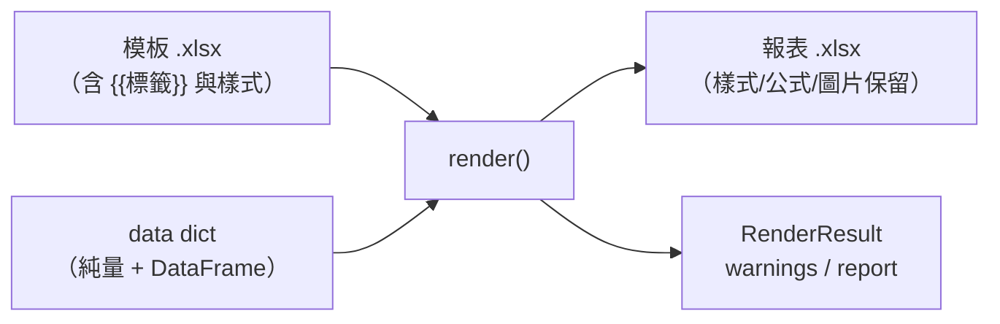
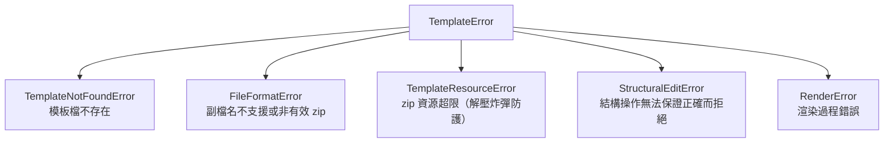

# templexl 使用者指南

> 受眾：使用本套件渲染模板 Excel 模板，再產出 Excel 報表的開發者。
> 想了解內部架構請見 [ARCHITECTURE.md](ARCHITECTURE.md)。

`templexl` 讓你用熟悉的 Excel 設計報表版面（樣式、合併儲存格、表格、
公式、圖片），再以標籤填入資料，輸出成最終報表。**無需安裝 Excel**。



## 安裝

```bash
pip install templexl
```

需求：Python 3.12+。相依 `openpyxl>=3.1.5`、`pandas>=2.0.3`、`pillow>=12.3.0`。

## 快速開始

1. 用 Excel 做一份模板 `template.xlsx`，在儲存格中放標籤：

   |   | A | B |
   |---|---|---|
   | 1 | 製表人： | `{{oper_name}}` |
   | 2 | `#{{report_df}}` |  |

2. 呼叫 `render()`：

```python
import pandas as pd
from templexl import render

result = render(
    template="template.xlsx",
    output="output.xlsx",
    data={
        "oper_name": "王小明",
        "report_df": pd.DataFrame({
            "姓名": ["Alice", "Bob"],
            "部門": ["技術部", "業務部"],
        }),
    },
)
print(result.output_path)   # 'output.xlsx'
print(result.warnings)      # 非致命警告清單（如未解析的標籤）
```

## 模板語法

| 語法 | 說明 |
|------|------|
| `{{變數名稱}}` | 以 `data` 中對應的**純量值**取代。可內嵌於文字中（如儲存格值為 `期間：{{date_rng}}`），標籤內空白容忍（`{{ name }}` 亦可） |
| `#{{資料表名稱}}` | 以 `data` 中對應的 **pandas DataFrame** 展開為表格，第一列為欄位標題 |
| `#{{資料表名稱 \| noheader}}` | 展開 DataFrame 但**略過欄位標題列**——用於模板已自行排版表頭的情境 |

展開表格時引擎會自動：

- 依資料列數**批次插入新列**，並複製模板列的樣式與公式
- 複製到新列的公式採 **Excel 複製語意**平移（模板列 `=B2*2` 複製到下一列
  成為 `=B3*2`）；插入點**下方既有**儲存格的公式**不平移**（其內容整列
  往下位移，公式原文不變），詳見〈已知限制〉
- 把展開區域**下方**的其他標籤與圖片錨點依實際插入列數往下位移
- 若標籤綁定 Excel「表格」物件（插入 > 表格），同步擴增
  `table.ref` 與篩選範圍，保留表格樣式與**合計列**（見下節）

### Excel 表格合計列

模板中的 Excel 表格若勾選了「合計列」（表格設計 > 合計列），渲染後合計列
會**緊接最後一筆資料列**保留下來，內容、樣式與公式原文皆不變；表格範圍
（`table.ref`）涵蓋合計列，篩選範圍（`autoFilter.ref`）則**不含**合計列
——與 Excel 自己的慣例一致。`[#Totals]` 結構化參照，以及引用它的具名範圍
（例如 `total_space = 表格1[[#Totals],[TABLE_SIZE_MB]]`），在輸出檔中都能
正常解析。

```
模板（A1:C3，合計列在第 3 列）        渲染 5 筆後（A1:C7）
┌──────────┬───────────┬────────────┐  ┌──────────┬───────────┬────────────┐
│TABLE_NAME│TABLE_ROWS │TABLE_SIZE_MB│ │TABLE_NAME│TABLE_ROWS │TABLE_SIZE_MB│
├──────────┼───────────┼────────────┤  ├──────────┼───────────┼────────────┤
│#{{rep_df │ noheader}}│            │  │ …5 筆資料列…                      │
├──────────┼───────────┼────────────┤  ├──────────┼───────────┼────────────┤
│ 合計     │           │=SUBTOTAL(  │  │ 合計     │           │=SUBTOTAL(  │
│          │           │ 109,表格1  │  │          │           │ 109,表格1  │
│          │           │ [欄])      │  │          │           │ [欄])      │
└──────────┴───────────┴────────────┘  └──────────┴───────────┴────────────┘
   autoFilter = A1:C2                     autoFilter = A1:C6（不含合計列）
```

**契約：合計列的公式必須用結構化參照。** 引擎**不改寫**合計列裡的任何公式，
也不因插列而平移下方公式（見〈已知限制〉）。所幸這正是 Excel 勾選合計列時
的預設寫法：

```
✅ =SUBTOTAL(109,表格1[TABLE_SIZE_MB])   隨表格範圍自動涵蓋全部資料列
❌ =SUM(C2:C2)                            寫死 A1 範圍，插列後不會擴張
```

其他要點：

- **noheader 與 header 模式皆支援**。`#{{df | noheader}}` 保留模板表頭與整份
  欄定義；`#{{df}}` 由 DataFrame 提供表頭並重建欄定義，此時以**欄名比對**
  沿用模板欄的合計列設定（標籤文字、彙總函式、自訂公式）。
- **欄名改變＝參照失效**。header 模式下若 DataFrame 的欄名與模板不同，該欄
  不會繼承合計列設定，且原本 `[舊欄名]` 的參照會變成 `#REF!`——這與 Excel
  自身行為一致，屬模板作者責任。
- **空 DataFrame**：表格至少保留**一列空白資料列**（Excel 表格不允許零資料
  列），範圍為表頭＋空白列（＋合計列），合計列公式對空資料列計算得 0。
- **標籤不要放在合計列**。合計列是 Excel 的彙總列而非資料列；標籤放在那裡
  不會與表格物件綁定，引擎會發出 warning 指出表格名稱與儲存格座標。

## 模板圖形、浮水印與頁首頁尾圖片

openpyxl 只模型化圖片（`<xdr:pic>`，且需 Pillow 讀得動）與圖表；模板上
其餘繪圖內容——AutoShape、文字方塊、連接線、EMF／WMF 圖片、頁首頁尾
圖片——在 openpyxl 的 load/save round-trip 中會**無聲消失**（不拋例外、
不發 warning）。templexl 在載入模板時原樣留存這些內容，存檔後於 zip 層
回填，使大小章方框、清分章與浮水印不會在報表中消失。

可執行範例：[`examples/render_watermark.py`](../examples/render_watermark.py)
——渲染後讀回輸出檔清點各工作表的形狀與頁首圖片，可直接套用於自己的
產製流程做驗證（只用標準函式庫，不需安裝 Excel）。

### 支援範圍

| 內容 | 支援 |
|------|------|
| AutoShape、文字方塊、連接線、不含圖片的群組 | ✅ 保留，含文字、旋轉、填色、透明度；可與同表圖片或圖表共存 |
| openpyxl 無法解析的圖片（EMF、WMF、Pillow 開不了的格式） | ✅ 保留，媒體內容與模板相同，不與 openpyxl 能保留的圖片重複 |
| 頁首／頁尾圖片（`&G` + `legacyDrawingHF` → VML），含奇數頁、偶數頁、首頁 | ✅ 保留，圖片內容、頁首頁尾文字皆與模板相同；可與儲存格註解並存 |
| 工作表背景圖（`<picture>`）、含圖片的群組、DrawingML 頁首頁尾（`drawingHF`）、非圖表的 `graphicFrame`（如 SmartArt）、外部連結（非內嵌）圖片的媒體內容 | ❌ 不支援 |

**Pillow 為正式依賴**（`pillow>=12.3.0`）：判斷「openpyxl 是否已保留某張
內嵌圖片」需要實際以 Pillow 開啟該圖片並檢查格式，鏡像 openpyxl 自身
`find_images()` 的判定邏輯——僅無法解析或格式為 WMF（含 EMF）的圖片才需要
本套件接手保留。

### 錨點位移：整表單一位移

形狀與圖片錨點的位移規則，與 openpyxl 保留的圖片**完全一致**：以工作表
最上緣表格標籤的下一列為起點，起點（含）以下的錨點一律下移「該工作表
全部表格標籤插入列數的總和」；起點以上者不動。

> **已知限制**：夾在兩個表格標籤之間的形狀／圖片，下移量是**全部**表格
> 標籤插入列數的總和，而非只受其上方那個標籤影響——這與 Excel 逐一插入點
> 各自位移的直覺不同。需要逐插入點位移的情境請等候後續版本；目前請將
> 形狀／圖片放在**全部**表格標籤的上方或下方，避免夾在中間。

### 失敗處理

模板繪圖內容無法擷取或回填時，`Book(...)`、`Book.save()` 或 `render()`
會拋出 `RenderError`，**不會**產出缺少模板繪圖內容的輸出檔（fail fast）；
存檔失敗時輸出路徑維持呼叫前狀態（原本不存在則仍不存在，原有檔案則
內容不變）。

### 與 `delete_columns()` 的互動

工作表含模板形狀或 openpyxl 會丟棄的圖片時，`delete_columns()` 拒絕
執行（見〈`Sheet.delete_columns(idx)`〉）；頁首頁尾圖片不綁欄位，不受
影響、不阻擋刪欄。

## API 參考

### `render()`

```python
render(
    template: str,
    output: str,
    data: dict | None = None,
    *,
    with_report: bool = False,
    escape_formulas: bool = True,
) -> RenderResult
```

| 參數 | 型別 | 預設 | 說明 |
|------|------|------|------|
| `template` | `str` | — | 模板檔路徑，僅接受 `.xlsx` / `.xlsm`。載入前會做 zip 資源檢查（解壓總量上限 2GB、壓縮比上限 200:1），防惡意模板的資源耗盡攻擊 |
| `output` | `str` | — | 輸出檔路徑。**若已存在會被覆寫**；寫入為原子操作（先寫暫存檔再取代），渲染中途失敗不會留下半寫入的檔案 |
| `data` | `dict` | `None` | 渲染資料。鍵 = 標籤名稱；值 = 純量（`str`/`int`/`float`/`bool`/`datetime`）或 `pandas.DataFrame`。模板中有標籤但 `data` 未提供時**不會報錯**，會列入 `warnings` |
| `with_report` | `bool` | `False` | 是否產生渲染報告（見 [RenderReport](#renderreport)）。報告為記憶體物件，不會自動寫檔 |
| `escape_formulas` | `bool` | `True` | 公式注入防護。開啟時，`data` 中以 `=`、`+`、`-`、`@`、tab、CR 開頭的**字串值**一律以純文字寫入（值本身不被改寫），Excel 開啟時不會當作公式執行。**模板內由你撰寫的公式完全不受影響**。僅在資料來源完全可信、且需要以資料動態注入公式時才傳 `False` |

### `RenderResult`

| 欄位 | 型別 | 說明 |
|------|------|------|
| `output_path` | `str` | 已寫出的輸出檔路徑 |
| `warnings` | `list[str]` | 非致命警告，例如「未解析的標籤 '{{xxx}}'（工作表、儲存格座標）」。**建議每次檢查**，可及早發現拼錯的標籤名 |
| `report` | `RenderReport \| None` | 渲染報告；僅 `with_report=True` 時提供 |

### `RenderReport`

除錯與稽核用途：記錄每張工作表中每個渲染物件的型別、最終位置與資料形狀
（**不含儲存格資料值**，無個資疑慮）。

| 成員 | 說明 |
|------|------|
| `template_path` / `output_path` | 本次渲染的輸入/輸出路徑 |
| `worksheets` | `dict`，鍵為工作表名稱，值含物件清單（`obj_id`、`obj_type`、`position`、`data_shape` 等） |
| `summary` | 整體統計：`total_worksheets`、`total_objects` |
| `to_dict()` | 轉純 dict |
| `write_json(path)` | 寫成 JSON 檔——**是否落地、寫到哪，完全由你決定** |

### `Book`（會話式 API）

`render()` 是一次性 facade；需要在**渲染與存檔之間**插入結構操作，或**逐工作表**
填入不同資料時，使用 `Book`。生命週期唯一歸屬 `Book`：載入發生於建構，
落地只發生於 `save()`——離開 `with` 區塊**不會**自動存檔。

```python
Book(template: str | os.PathLike)
```

| 成員 | 說明 |
|------|------|
| `render(data, *, escape_formulas=True, with_report=False)` | 渲染整份工作簿（記憶體內）。回傳 `BookRenderResult`（`warnings`、`report`） |
| `save(output)` | 原子寫入輸出檔（暫存檔 + rename），回傳輸出路徑。存檔前同步 Excel 表格範圍 |
| `sheets` | 工作表存取器；支援 `bk.sheets[0]` 與 `bk.sheets["名稱"]`，可迭代、可 `len()` |
| `workbook` | 底層 openpyxl `Workbook`（**逃生門**） |
| `template_path` | 來源模板路徑 |
| `close()` | 釋放工作簿參照（不存檔，重複呼叫安全） |

### `Sheet`

由 `Book.sheets` 取得。只提供 templexl 才做得到的操作；其餘經 `ws` 用 openpyxl 原生 API。

| 成員 | 說明 |
|------|------|
| `render(data, *, escape_formulas=True)` | **只渲染本工作表**——掃描、映射、渲染三階段皆限縮於此表，其他工作表不被讀寫。回傳 `SheetRenderResult`（`sheet_name`、該表範圍的 `warnings`） |
| `delete_columns(idx)` | Excel 等效刪整欄（1-based）。見下節 |
| `ws` | 底層 openpyxl `Worksheet`（**逃生門**） |
| `title` / `book` | 工作表名稱／所屬 `Book` |

本工作表已無任何標籤時（通常代表已渲染過），`render()` 為 no-op：不改動儲存格、
不拋例外，僅發出 warning 級日誌。

### `Sheet.delete_columns(idx)`

openpyxl 的 `delete_cols` 只搬動儲存格，不調整合併範圍、欄寬與列印範圍。
本方法補齊三者，使結果與 Excel「刪除整欄」等效：

| 面向 | 行為 |
|------|------|
| 儲存格 | 值與樣式左移（委派 openpyxl） |
| 合併範圍 | 跨越刪除欄者縮 1；完全在右側者左移 1；整段落在被刪欄或塌成 1×1 者丟棄；左側不動 |
| 欄寬 | 自刪除欄起左移一位；右鄰無紀錄者清除該欄紀錄（回歸預設寬度） |
| 列印範圍 | 跨越者右界縮 1；右側者左移 1；整段被刪則移除 |

刪除多欄請**由大到小**逐次呼叫，讓座標全程以原始欄位計算：

```python
for col in sorted(del_cols, reverse=True):
    sht.delete_columns(col)
```

工作表存在下列任一特徵時拋出 `StructuralEditError`（訊息含種類與位置），
且**不做任何修改**：公式、圖片、圖表、Excel 表格、條件格式、資料驗證、
模板形狀（AutoShape、文字方塊等 openpyxl 無法表示的繪圖）、openpyxl 會
丟棄的圖片（如 EMF／WMF）。頁首頁尾圖片不綁欄位，**不會**阻擋刪欄。

> **為什麼公式一律拒絕**：引擎現有的公式平移實作的是 Excel **複製語意**（公式自己
> 移動，相對參照隨之平移、`$` 絕對參照不動），而刪欄需要的是 **參照改寫語意**
> （公式不動也要改：指向刪除欄右側的參照連同絕對參照一併左移，指向被刪欄者變
> `#REF!`，左側不動）。兩者僅在窄情境碰巧等價，硬套會靜默算錯。

### 例外階層

所有例外皆繼承自 `TemplateError`，可一次攔截：



```python
from templexl import render, TemplateError

try:
    result = render("t.xlsx", "o.xlsx", data={...})
except TemplateError as e:
    print(f"渲染失敗：{e}")
```

渲染失敗時**不會**留下半成品輸出檔——`output` 路徑維持呼叫前的狀態。

## 使用範例

完整可執行範例在 [examples/](../examples/) 目錄（含真實模板檔）：

```bash
uv run python examples/render_report.py        # 基本：多工作表報表
uv run python examples/render_excel_table.py   # 進階：Excel Table 物件 + 渲染報告
uv run python examples/render_watermark.py     # 模板圖形／浮水印保留與驗證
```

### 範例：公式注入防護的行為

```python
import pandas as pd
from templexl import render

data = {
    "note_df": pd.DataFrame({
        "備註": ['=HYPERLINK("http://evil","點我")', "正常文字"],
        "金額": [-42, 100],          # 數值（含負數）不受影響
    }),
}

# 預設：'=' 開頭的字串以純文字寫入，開啟報表時不會執行任何公式
render("t.xlsx", "safe.xlsx", data=data)

# 顯式停用（僅在資料完全可信時）：'=' 開頭字串成為真正的公式
render("t.xlsx", "legacy.xlsx", data=data, escape_formulas=False)
```

### 範例：渲染後做結構後處理

以 `Book` 在單次 load/save 內完成「渲染 → 合併 → 刪欄 → 存檔」：

```python
from templexl import Book

with Book("template.xlsx") as bk:
    bk.render({"plan_name": "方案A", "detail_df": df})

    sht = bk.sheets[0]
    sht.ws.merge_cells("A9:C9")      # openpyxl 原生（逃生門）
    sht.delete_columns(11)           # Excel 等效刪整欄

    bk.save("output.xlsx")           # 落地必須顯式
```

### 範例：逐工作表填入不同資料

「複製同一份模板工作表 N 份、每份不同資料」——workbook 級的 `render()`
做不到（同名標籤只能吃同一份資料），sheet 級入口可以：

```python
with Book("template.xlsx") as bk:
    sample = bk.workbook["Sample"]
    for vehicle, detail_df in data_by_vehicle.items():
        copied = bk.workbook.copy_worksheet(sample)   # openpyxl 原生
        copied.title = vehicle
        bk.sheets[vehicle].render({"vehicle_desc": vehicle, "detail_df": detail_df})
    del bk.workbook["Sample"]
    bk.save("output.xlsx")
```

### 範例：渲染報告

```python
result = render("t.xlsx", "o.xlsx", data=data, with_report=True)

print(result.report.summary)
# {'total_worksheets': 7, 'total_objects': 86}

result.report.write_json("render_report.json")   # 需要留檔時自行落地
```

### 範例：函式庫日誌

套件遵循標準函式庫慣例（`NullHandler`），預設不輸出任何訊息。
需要診斷時自行開啟：

```python
import logging
logging.basicConfig(level=logging.DEBUG)
logging.getLogger("templexl").setLevel(logging.DEBUG)
```

日誌只記錄流程與資料形狀，不會輸出儲存格內容，可安心在含個資的
資料上開 DEBUG。

## 資料量與記憶體

耗時與峰值記憶體皆隨列數近似線性。參考實測
（Apple Silicon、Python 3.12、單表 5 欄）：

| 列數 | 耗時 | 峰值記憶體（RSS） |
|------|------|-------------------|
| 10,000 | ~1.5 秒 | ~0.13 GB |
| 100,000 | ~15 秒 | ~0.65 GB |
| 500,000 | ~79 秒 | ~2.8 GB |

建議：

- 50 萬列以上請確保執行環境有 8GB 以上可用記憶體
- 欄數加倍、多張大表時記憶體等比上升，請先在目標環境以
  `tests/benchmark.py` 實測
- 百萬列等級建議將資料分批為多個輸出檔

## 已知限制

- **公式平移**：以列向參照調整為主；含數字的函式名（如 `LOG10`）、
  跨工作表參照等情境尚有已知缺陷。
- **插入點下方的公式不平移**：引擎目前只有「複製語意」（把模板列的公式
  複製到新列時平移），**不會**因為插入了 N 列而去改寫插入點下方既有公式
  的參照。因此像 `=SUM(C2:C2)` 這種寫死 A1 範圍的彙總不會跟著擴張——
  **彙總請改用結構化參照**（`=SUBTOTAL(109,表格1[金額])`），由 Excel 依
  表格範圍即時解析，不需引擎改寫。具名範圍、條件格式、資料驗證與列印
  範圍的參照同樣不隨插列調整。
- **圖片**：僅平移列向錨點，不處理欄向位移。
- **變數位置**：少數位於展開表格「下方」的純量標籤可能不被替換——
  會列入 `warnings`，請檢查後調整模板版面（例如把純量標籤移到表格上方）。
- **模板圖形保留的範圍邊界**：工作表背景圖（`<picture>`）、含圖片的群組、
  DrawingML 頁首頁尾（`drawingHF`，非 legacy VML）、非圖表的 `graphicFrame`
  （如 SmartArt）、外部連結（非內嵌）圖片的媒體內容，皆不在保留範圍內；
  `copy_worksheet` 複製出的工作表不會帶入來源工作表的模板圖形（與
  openpyxl 原生複製行為一致）；VML 內容本身（shape id、idmap）不被改寫。
  夾在兩個表格標籤之間的形狀／圖片位移量，見〈模板圖形、浮水印與頁首
  頁尾圖片〉。

## FAQ

**Q：模板裡的公式會被 `escape_formulas` 中和嗎？**
不會。中和只針對執行期 `data` 帶入的字串值；你在模板裡寫的公式
（含表格展開時自動平移的公式）完全保留。

**Q：`data` 少給了一個標籤的值會怎樣？**
不會報錯。該標籤保持原樣留在輸出中，並在 `result.warnings` 列出
名稱與座標。 

**Q：輸出檔已存在會怎樣？**
無條件覆寫（與 xlwings Reports 相同語意）。需要保護請在呼叫前自行檢查
`os.path.exists(output)`。

**Q：可以在多執行緒/多程序中使用嗎？**
每次 `render()` 呼叫彼此獨立（無共享可變狀態），可在多程序中平行
渲染不同輸出檔；但請留意每個渲染程序的記憶體占用（見上表）。
